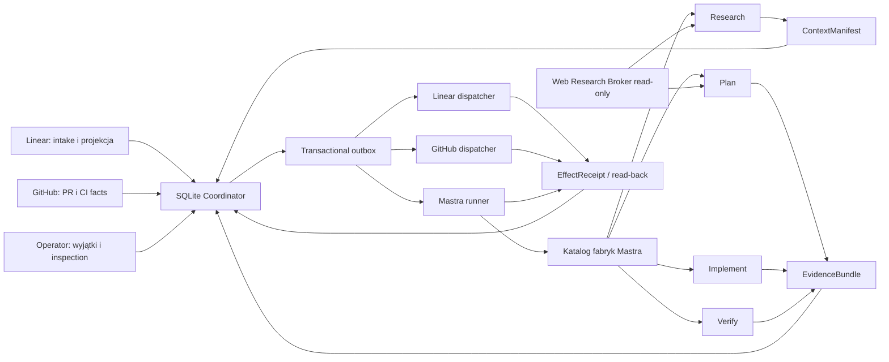

# AI Software Factory — finalny plan rozwoju

Data decyzji: 2026-07-23
Horyzont wykonawczy: 90 dni
Status: zaakceptowany kierunek architektoniczny

## 1. Decyzja wykonawcza

Rozwijamy `ai-factory` jako zestaw czterech ograniczonych fabryk:
`research`, `plan`, `implement` i `verify`. Wszystkie korzystają z jednego
centralnie zarządzanego harnessu, ale żadna nie jest właścicielem lifecycle
ticketu.

Jedynym właścicielem stanu, przejść i efektów zewnętrznych będzie transakcyjny
coordinator oparty o SQLite. Mastra pozostaje warstwą wykonawczą dla workflowów,
agentów, supervisorów, scorerów i obserwowalności.

Przyjmujemy następujące decyzje operatora:

1. bramki człowieka zależą od deterministycznego poziomu ryzyka;
2. cztery typy fabryk działają pod jednym coordinatorem i harness-em;
3. North Star na 90 dni to zweryfikowany throughput i lead time przy braku
   defect escape;
4. kontekst jest minimalny i wersjonowany, ale agent może przeglądać linki oraz
   WWW przez kontrolowane narzędzia read-only;
5. pilot działa na zaufanym Macu, z Effect Firewall i capability leases;
6. pierwszy pionowy slice obejmuje `br-factory` oraz shadow runy `pilot-app`;
7. zwykłe wyjątki są obsługiwane w dwóch batchach tygodniowo, a natychmiast
   eskalowane są tylko zdarzenia high-risk.

Nie wprowadzamy automatycznego merge w tym horyzoncie. Zdejmujemy niepotrzebną
akceptację planu dopiero po przejściu progów shadow i pilota low-risk.

## 2. Docelowa topologia

### 2.1 SQLite Coordinator

Coordinator:

- redukuje typowane eventy do jednego stanu lifecycle;
- zapisuje stan, transition, inbox, outbox i klucz idempotencji w jednej
  transakcji;
- stosuje deterministyczne polityki ryzyka i bramek;
- zleca pracę Mastrze, ale nie oddaje jej prawa do zmiany stanu biznesowego;
- wykonuje efekty wyłącznie przez adaptery i zapisuje ich receipts;
- po restarcie uzgadnia stan z Linear, GitHub i Mastrą przez read-back.

Docelowe tabele:

- `tickets`, `runs`, `transitions`;
- `commands`, `inbox`, `outbox`;
- `effects`, `effect_receipts`;
- `gates`, `operator_decisions`;
- `context_manifests`, `context_items`;
- `evidence_bundles`, `assessments`;
- `policy_versions`, `factory_versions`.

### 2.2 Mastra

Natywne funkcje Mastry wykorzystujemy w następujących granicach:

| Funkcja Mastry | Zastosowanie | Czego nie robi |
| --- | --- | --- |
| Workflows | deterministyczna kolejność wewnątrz konkretnej fabryki | nie zarządza globalnym lifecycle ticketu |
| Agents | research, intake, planowanie i semantyczna inspekcja | nie wykonuje bezpośrednich zapisów Linear/GitHub |
| Supervisor agents | delegowanie ograniczonych zadań w ramach jednej fabryki | nie wybiera dowolnego workflow ani efektu |
| Delegation hooks i message filters | limity iteracji, filtrowanie kontekstu i anulowanie | nie zastępują capability leases |
| Tool approvals | dodatkowa bramka dla narzędzia o podwyższonym ryzyku | nie są źródłem polityki lifecycle |
| Scorers i eval gates | ocena kompletności oraz jakości evidence | nie publikują i nie zmieniają statusów |
| Observability | latency, tokeny, koszt, tool calls i traces | nie zastępuje metryk delivery |
| Workspace/sandbox | kolejny poziom izolacji w BAR-162 | nie jest wymagany do startu pilota na zaufanym Macu |

`AgentController` pozostaje opcjonalnym eksperymentem UI po horyzoncie 90 dni.
Jest funkcją beta i nie może stać się źródłem stanu ani blokować budowy kernela.

### 2.3 Transactional Effect Firewall

Żaden agent ani workflow Mastry nie wykonuje docelowo bezpośredniej mutacji
Lineara, GitHuba lub produkcji.

Przepływ efektu:

1. Mastra zwraca typowany `Fact` albo `EffectIntent`.
2. Coordinator sprawdza stan, politykę, lease oraz wersję artefaktów.
3. W jednej transakcji zapisuje transition i idempotentną komendę outbox.
4. Dispatcher wykonuje operację.
5. Adapter ponownie odczytuje system docelowy i zapisuje `EffectReceipt`.
6. Dopiero potwierdzony receipt może odblokować kolejne przejście.

Capability lease określa co najmniej:

- `ticketId`, `runId`, factory type i stage;
- repo, branch, workspace oraz dozwolone ścieżki;
- typy narzędzi i efektów;
- limity czasu, kosztu, iteracji i tool calls;
- moment wygaśnięcia oraz oczekiwany stan lifecycle.

## 3. Kontrakty między fabrykami

Każdy kontrakt ma `schemaVersion`, `factoryVersion`, `policyVersion`, `runId`,
`inputHash` i podpis wykonawcy.

| Kontrakt | Producent | Minimalna zawartość |
| --- | --- | --- |
| `IntakeDecision` | intake agent + policy matrix | factory type, kompletność, risk suggestion, wymagane evidence |
| `ContextManifest` | context builder | źródła, hash, timestamp, TTL, autorytatywność, trust i token budget |
| `ResearchEvidence` | research factory | pytania, ustalenia, źródła, sprzeczności i niewiadome |
| `PlanContract` | plan factory | zakres, pliki, kryteria, testy, ryzyka i wymagane evidence |
| `ImplementEvidence` | implement factory | exact SHA, changed files, checks, build report i podpis wykonawcy |
| `VerifyEvidence` | verify factory | exact SHA, wyniki checks/e2e, kryteria, screenshoty i verdict |
| `EffectIntent` | dowolna fabryka | żądany efekt bez prawa wykonania |
| `EffectReceipt` | dispatcher | idempotency key, remote ID, read-back i wynik |

`subjectSha` w implementacji, verify, CI i publikacji musi być identyczny.
Zmiana SHA unieważnia evidence i wymaga pełnego reverify.

## 4. Intake Compiler i cztery fabryki

### 4.1 Intake Compiler

Intake Compiler jest ograniczonym agentem Mastry. Dostaje immutable snapshot
ticketu, projekt, politykę i wyliczony kontekst. Nie ma mutujących narzędzi i
zwraca wyłącznie `IntakeDecision`.

Coordinator:

1. waliduje odpowiedź schematem;
2. oblicza deterministyczny risk tier;
3. porównuje sugestię agenta z policy matrix;
4. wybiera fabrykę, `needs_input` albo inspection;
5. zapisuje decyzję i komendy w SQLite.

### 4.2 Research

Research jest jedyną fabryką, która domyślnie może korzystać z wyszukiwarki i
otwierać strony WWW. Plan może poprosić research o uzupełnienie konkretnej luki,
ale nie otrzymuje nieograniczonego browsera.

Wynikiem jest `ResearchEvidence`, a nie plan implementacji ani mutacja systemu.

### 4.3 Plan

Plan zamienia ticket, odpowiedzi operatora i `ContextManifest` w
`PlanContract`. Dopytuje człowieka tylko wtedy, gdy brak rozstrzygnięcia wpływa
na zachowanie, ryzyko lub zakres. Decyzje kosmetyczne podejmuje sam.

### 4.4 Implement

Implement działa w worktree i w granicach lease. Builder może zmieniać tylko
zadeklarowane ścieżki. Wynikiem jest commit i `ImplementEvidence`, nie push ani
PR wykonywany bezpośrednio przez agenta.

### 4.5 Verify

Verify działa read-only na świeżym checkoutcie dokładnego SHA. Łączy:

- deterministyczne checks, lint, testy, SAST/SCA i E2E;
- niezależny semantyczny verifier;
- scorery kompletności evidence;
- screenshoty lub prod checks, jeśli wymagane przez projekt.

Werdykt negatywny zwraca `ReturnLabel` do najwcześniejszej odpowiedzialnej
fabryki wraz z minimalnym defect bundle. Coordinator decyduje o retry i limicie.

## 5. Polityka kontekstu i WWW

### 5.1 Hierarchia autorytatywności

Od najwyższej do najniższej:

1. polityki repo, `AGENTS.md`, `projects.yaml` i zatwierdzone decyzje operatora;
2. treść ticketu i późniejsze odpowiedzi człowieka;
3. kod, testy, CI i artefakty dla dokładnego SHA;
4. oficjalna dokumentacja produktu lub biblioteki;
5. inne źródła znalezione w WWW.

Niższe źródło nie może nadpisać wyższego. Konflikt istotny dla wyniku powoduje
`needs_input` albo inspection.

### 5.2 Web Research Broker

Agent otrzymuje capability `web:read`, która pozwala:

- wyszukiwać WWW;
- otwierać linki wskazane w tickecie lub wynikach wyszukiwania;
- pobierać tekst i metadane wspieranych dokumentów;
- cytować źródła w evidence.

Capability nie pozwala domyślnie:

- logować się do serwisów ani używać prywatnych cookies;
- wysyłać formularzy i wykonywać akcji mutujących;
- pobierać lub uruchamiać plików wykonywalnych;
- łączyć się z localhost, siecią prywatną lub endpointami metadanych hosta;
- traktować instrukcji znalezionych na stronie jako poleceń systemowych.

Każdy web context item zapisuje:

- pełny URL i domenę;
- czas pobrania i TTL;
- hash pobranej treści;
- tytuł, typ źródła i deklarowany trust;
- fragmenty faktycznie użyte w decyzji;
- relację do kryterium lub pytania research.

Domyślny pakiet WWW ma limit czasu, liczby stron i tokenów konfigurowany per
projekt. Przekroczenie kończy research częściowym evidence, a nie nieskończoną
pętlą.

Surowych raportów Gartnera nie dodajemy do RAG, promptów, evali ani corpusów
fabryki. Plan zawiera wyłącznie nasze decyzje i sparafrazowane wymagania.

## 6. Risk tiers i bramki człowieka

Agent może zasugerować tier, ale ostatecznie wyznacza go policy engine.
Niepewność podnosi ryzyko; nigdy go nie obniża.

| Tier | Przykładowy zakres | Plan approval | Inspection | Publikacja |
| --- | --- | --- | --- | --- |
| Low | dokumentacja, testy, małe lokalne UI/backend bez auth, danych i migracji | nie, po przejściu gate pilota | batch exit inspection | draft/ready PR, manualny merge |
| Medium | kilka modułów, zależności, zachowanie użytkownika, integracje read-only | tylko przy niejasności | obowiązkowa przed `ready` | manualny merge |
| High | auth, finanse, sekrety, migracje, prod data, infra, destrukcja, compliance | obowiązkowa | obowiązkowa, rozszerzona | ręczny merge/release i mocniejszy verify |

Automatycznie high-risk są co najmniej:

- operacje destruktywne lub nieodwracalne;
- migracje schematu i produkcyjnych danych;
- auth, uprawnienia, płatności i sekrety;
- produkcyjne DNS, deployment, infrastruktura i zmiana credentials;
- nieznany lub niespójny kontekst;
- żądanie wyjścia poza repo, projekt albo lease.

W pierwszej fazie zachowujemy aktualne bramki dla wszystkich realnych runów.
Kompresję bramek low-risk włączamy dopiero po przejściu promotion gates.

## 7. HIL Shadow Factory i kontrolowany wzrost autonomii

Shadow używa tego samego coordinatora i tych samych kontraktów, ale adaptery
mutujące zastępuje lokalnymi ledgerami. Fault injector przerywa wykonanie:

- przed efektem;
- po efekcie, ale przed zapisem receipt;
- przy podwójnej dostawie eventu;
- podczas restartu procesu;
- przy timeoutach Linear, GitHub i Mastry;
- przy nieaktualnym lub zatrutym kontekście.

### Gate L0 → L1: shadow do pilota wspomaganego

Wymagane:

- co najmniej 20 shadow/golden runów;
- zero podwójnych efektów;
- 100% zgodności `subjectSha` w evidence;
- recovery rate co najmniej 95%;
- zero defect escape względem golden acceptance;
- poprawne zatrzymanie każdego high-risk i `needs_input`.

Przejście wymaga ręcznej decyzji operatora. Metryka nie włącza autonomii sama.

### Gate L1 → risk-tier compression

Wymagane na co najmniej 20 realnych ticketach low-risk w `br-factory` i
`pilot-app`:

- zero podwójnych efektów zewnętrznych;
- zero escaped defects i rollbacków;
- first-pass verify co najmniej 80%;
- mediana pracy człowieka nie większa niż 10 minut na ticket;
- mediana lead time krótsza o co najmniej 25% od baseline;
- 100% evidence oraz web claims z provenance.

Po przejściu gate można wyłączyć plan approval dla low-risk. Merge nadal
pozostaje decyzją człowieka.

High-risk nie otrzymuje dalszej autonomii w horyzoncie tego planu.

## 8. North Star i metryki

North Star:

`verified deliveries accepted in a rolling 7-day window`

Delivery jest policzone tylko wtedy, gdy exact SHA przeszedł wymagane checks,
evidence gate, inspection i został zaakceptowany bez późniejszego rollbacku.

### Baseline z 2026-07-23

- 374 zarejestrowane zdarzenia;
- 87 runów;
- first-pass verify: 73% (`44/60`);
- review LGTM w pierwszej rundzie: 51% (`24/47`);
- zarejestrowany ekwiwalent kosztu: `$135.394`, niepełny dla wszystkich
  harnessów.

### Wymagane metryki

- median i p95 `ticket discovered → verified draft`;
- median i p95 `verified draft → merge`;
- accepted deliveries na tydzień;
- first-pass plan, verify i review;
- retries, rollback rate i defect escape;
- manual minutes per ticket i liczba wyjątków;
- koszt oraz tokeny per accepted delivery;
- duplicate effect count i reconciliation failures;
- recovery rate po awarii;
- context freshness, citation coverage i liczba konfliktów źródeł;
- rozkład risk tiers i odsetek automatycznie zablokowanych high-risk.

Najpierw osiągamy co najmniej 95% pokrycia kosztu wszystkich engine calls.
Dopiero wtedy koszt staje się celem optymalizacyjnym, a nie orientacyjną liczbą.

## 9. Operating model

Operator pracuje w modelu „spec-and-inspect”:

- definiuje intencję, kryteria i ograniczenia;
- rozstrzyga pytania, których nie można bezpiecznie wywnioskować;
- inspektuje evidence i wynik, a nie powtarza ręcznie całego QA;
- akceptuje promotion gates oraz zmiany policy version.

Zwykłe `needs_input`, medium inspection i low-risk exit inspection trafiają do
dwóch zaplanowanych batchy tygodniowo. Natychmiastowa notyfikacja jest
zarezerwowana dla:

- aktywnej próby efektu high-risk;
- rozjazdu stanu lub niepotwierdzonego efektu zewnętrznego;
- prod smoke failure po merge;
- podejrzenia wycieku credentiali lub prompt injection;
- lawinowego retry, kosztu albo defect escape.

## 10. Roadmapa 30/60/90

### Dni 0–30 — trustworthy kernel

Cel: jeden właściciel lifecycle i testowalne efekty.

1. Domknąć BAR-169 przed live cutoverem publikacji GitHub.
2. Zrealizować BAR-161: kanoniczne SQLite dla runów, gates, eventów i outboxa.
3. Zrealizować BAR-160: czysty reducer i porty `LinearProjection`,
   `GitHubLifecycle`, `MastraRunner`, `EngineRunner`, `QualityGateRunner`.
4. Wprowadzić `EffectIntent`, `EffectReceipt`, idempotency keys i read-back.
5. Dodać shadow adaptery oraz fault injection dla krytycznych efektów.
6. Przełączać ownership flagą per projekt: najpierw `pilot-app`, następnie
   `br-factory`. Nigdy nie utrzymywać dwóch aktywnych writerów.
7. Usunąć legacy ownera i persistence patch dopiero po pełnym cutoverze.

Exit criteria:

- restart i podwójna dostawa nie tworzą duplikatu komentarza, statusu ani PR-a;
- poller jest thin reconcilerem;
- Mastra nie wykonuje bezpośrednich mutacji Lineara/GitHuba;
- wszystkie przejścia i efekty mają immutable audit trail.

### Dni 31–60 — context, intake i evidence

Cel: ograniczone, mierzalne fabryki semantyczne.

1. Ukończyć BAR-131 jako wersjonowany `PlanContract`.
2. Zbudować `ContextManifest` i Web Research Broker.
3. Dodać `Intake Compiler` oraz deterministyczną policy matrix.
4. Wydzielić kontrakty `research`, `plan`, `implement`, `verify` pod wspólnym
   harness-em.
5. Zrealizować BAR-158 i uruchomić risk classification w shadow mode.
6. Rozszerzyć BAR-163 o `EvidenceBundle`, scorery Mastry, golden tickets i
   wersjonowanie prompt/model/router.
7. Wprowadzić `ReturnLabel` oraz defect bundle zamiast pełnego restartu
   pipeline'u.

Exit criteria:

- każdy run ma poprawny `ContextManifest`;
- każde stwierdzenie oparte o WWW ma URL, timestamp, hash i trust;
- 100% wyników fabryk przechodzi schema validation;
- evidence exact-SHA jest nieomijalnym warunkiem publikacji;
- high-risk oraz niekompletny intake zatrzymują się przed kosztownym buildem.

### Dni 61–90 — bounded low-risk autonomy

Cel: skrócić lead time bez pogorszenia jakości.

1. Przeprowadzić co najmniej 20 pełnych shadow/golden runów.
2. Po przejściu L0 → L1 uruchomić coordinator live dla `pilot-app` i
   `br-factory`.
3. Uruchomić dwa batch-e wyjątków tygodniowo.
4. Zebrać co najmniej 20 live ticketów low-risk.
5. Włączyć dashboard delivery, kosztu, quality i operator time.
6. Zamieniać powtarzalne failure signatures na test, regułę lub eval.
7. Po przejściu L1 gate wyłączyć plan approval wyłącznie dla low-risk.
8. Przygotować decyzję wejścia w BAR-162 przed dodaniem klienta lub
   credentiali o szerszym zakresie.

Exit criteria:

- osiągnięte promotion gates z sekcji 7;
- brak automatycznego merge i brak rozszerzenia na `br-budget`;
- operator może odtworzyć z evidence dlaczego ticket został wykonany,
  zablokowany albo zwrócony;
- każda zmiana policy, promptu, modelu lub routingu ma wersję i wynik shadow.

## 11. Mapa Lineara

### Istniejące tickety — proponowana kolejność

1. BAR-169 — bezpieczny publish/CI i zbieżność PR head.
2. BAR-161 — jedna trwała baza.
3. BAR-160 — coordinator i adaptery.
4. BAR-131 — kontrakt planowania.
5. BAR-158 — risk tiers.
6. BAR-163 — golden tickets, evals i delivery metrics.
7. BAR-162 — sandbox i scoped credentials przed multi-client.

BAR-139 pozostaje świadomie odłożony dla zaufanego, pojedynczego hosta. Nie
wolno przypadkowo wdrożyć go pod nazwą capability leases — leases ograniczają
efekty fabryki, ale nie zmieniają wcześniejszej decyzji o dostępie do lokalnych
skilli i MCP.

BAR-135 wraca przed produkcyjnym wejściem `br-budget`. BAR-137 jest potrzebny
dopiero przy realnym, pełnym projekcie fullstack.

### Brakujące work packages

Przed utworzeniem nowych ticketów trzeba ponownie przeszukać live projekt
`br-factory` i rozszerzyć istniejące zadanie, jeśli obejmuje ten sam zakres:

- Shadow adapters + fault injection;
- ContextManifest + Web Research Broker;
- Intake Compiler + factory catalog;
- Evidence contracts + ReturnLabel;
- operator exception batches + inspection inbox.

## 12. Ryzyka wykonawcze

| Ryzyko | Ochrona |
| --- | --- |
| dwa aktywne lifecycle writery podczas migracji | feature flag per projekt, jawny cutover i test zakazu starej ścieżki |
| shadow różni się od realnego GitHuba/Lineara | read-back contract tests i stopniowy canary na `pilot-app` |
| scorer blokuje poprawny wynik | wersjonowanie, zapis uzasadnienia i audytowalny manual override |
| strona WWW próbuje sterować agentem | untrusted-content boundary, message filter i brak mutujących browser tools |
| agent zaniża risk tier | tier liczony deterministycznie; niepewność tylko podnosi ryzyko |
| operator nie nadąża z inspection | dwa batche, minimalne evidence i natychmiast tylko high-risk |
| koszt jest pozornie niski przez brak danych | gate 95% cost coverage przed optymalizacją |

## 13. Poza zakresem 90 dni

- automatyczny merge albo release;
- autonomia high-risk;
- nieograniczony browser z loginem i prywatnymi cookies;
- ingest raportów Gartnera do kontekstu lub eval corpus;
- osobne deployowane mikroserwisy dla każdej fabryki;
- AgentController jako lifecycle owner;
- dynamiczne generowanie dowolnych workflowów przez supervisora;
- multi-client bez BAR-162.

## 14. Definition of Done planu 90-dniowego

Plan uznajemy za wykonany, gdy:

1. SQLite jest jedynym właścicielem lifecycle i efektów;
2. Linear i GitHub są projekcjami/fact sources, nie workflow engine'ami;
3. Mastra realizuje cztery ograniczone typy fabryk;
4. każdy run ma wersjonowany context, policy, factory i evidence;
5. web research jest read-only, cytowany i odporny na prompt injection;
6. risk tier determinuje bramki, ale high-risk zawsze zachowuje pełną kontrolę
   człowieka;
7. promotion gates zostały zaliczone na realnych danych pilota;
8. North Star i guardraile są raportowane z jednego źródła;
9. low-risk może ominąć plan approval, ale merge nadal wykonuje człowiek;
10. `br-budget` i multi-client pozostają zablokowane do osobnej decyzji.
