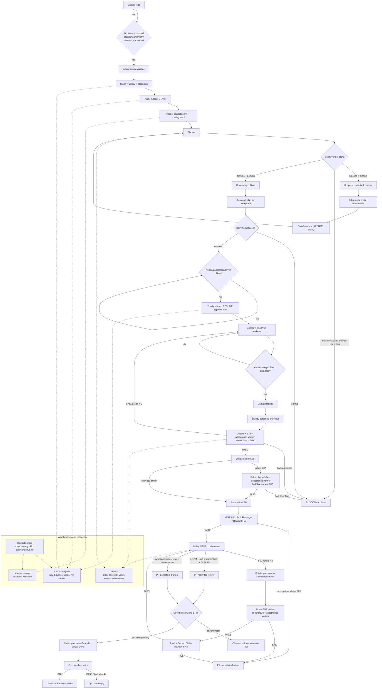

# Flow ticketu w ai-factory

Diagram opisuje kod produkcyjny po refaktorze niezawodności. Linear steruje
przepływem przez jawne stany; komentarze są raportem lub payloadem ścisłych komend,
nie są interpretowane heurystycznie.

## Gwarancje i granice

1. Claim następuje dopiero po utworzeniu runu Mastry i zapisie lokalnego rejestru.
2. `start` i `resume-no-wait` są sprawdzane po HTTP. Błąd transportu pozostawia
   komendę jako `pending`; kolejny tick lub restart ponawia ją. Snapshot potwierdza
   dalszy postęp runu.
3. Poller odzyskuje wszystkie niezakończone runy z `state.json`; nie rekonstruuje
   kluczowego stanu z tekstu komentarzy.
4. Końcowy stan Lineara (`Done`, `Canceled`, `Duplicate`) zatrzymuje aktywny run,
   więc silniki nie pracują po anulowaniu ticketu.
5. Werdykty agentów są fail-closed, ale checks, Git, status PR i prod smoke są
   wyznaczane przez kod deterministyczny.
6. Fabryka nie wykonuje automatycznego merge. Merge watcher obsługuje skutki
   decyzji człowieka i powtarza prod smoke po restarcie, jeśli nie został zapisany.
7. Każda zmiana SHA unieważnia `verifiedSha`; publikacja i zdjęcie draftu wymagają
   pełnych checks/e2e, acceptance verification oraz GitHub CI dla dokładnego head SHA.
8. Projekt bez deterministycznych `checks` lub GitHub `ci.requiredChecks` jest
   odrzucany przy intake. Zmiany buildera i remediation muszą mieścić się w
   zatwierdzonym `factory.files`.
