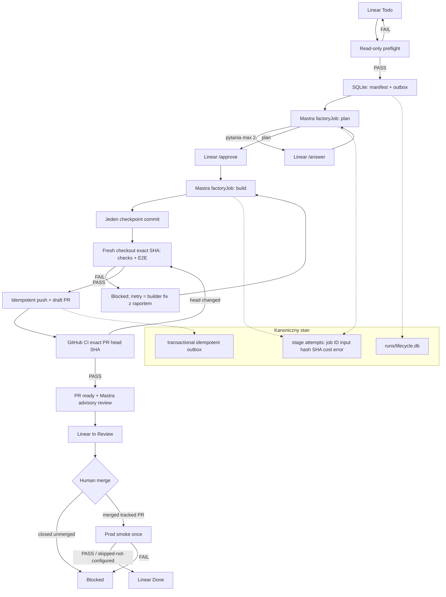

# Flow ticketu w ai-factory v2

```mermaid
flowchart TD
  A["Linear Todo"] --> B["Read-only preflight"]
  B -- "FAIL" --> A
  B -- "PASS" --> C["SQLite: manifest + outbox"]
  C --> D["Mastra factoryJob: plan"]
  D -- "pytania max 2" --> E["Linear /answer"]
  E --> D
  D -- "plan" --> F["Linear /approve"]
  F --> G["Mastra factoryJob: build"]
  G --> H["Jeden checkpoint commit"]
  H --> I["Fresh checkout exact SHA: checks + E2E"]
  I -- "FAIL" --> J["Blocked; /retry = builder fix z raportem"]
  J --> G
  I -- "PASS" --> K["Idempotent push + draft PR"]
  K --> L["GitHub CI exact PR head SHA"]
  L -- "head changed" --> I
  L -- "PASS" --> M["PR ready + Mastra advisory review"]
  M --> N["Linear In Review"]
  N --> O{"Human merge"}
  O -- "closed unmerged" --> X["Blocked"]
  O -- "merged tracked PR" --> P["Prod smoke once"]
  P -- "PASS / skipped-not-configured" --> Q["Linear Done"]
  P -- "FAIL" --> X

  subgraph Durable["Kanoniczny stan"]
    R["runs/lifecycle.db"]
    S["stage attempts: job ID input hash SHA cost error"]
    T["transactional idempotent outbox"]
  end
  C -.-> R
  D -.-> S
  G -.-> S
  K -.-> T
```

## Stany

Etap: `plan | approval | build | test | publish | ci | review | merge | smoke`.

Stan: `pending | running | waiting_human | waiting_external | blocked | done`.

Linear jest projekcją uproszczoną: `Todo`, `In Progress`, `In Review`, `Done`,
`👤 ⛔ Zablokowany`, `Canceled`. Zdarzenia GitHub i SQLite pozostają źródłem
prawdy nawet po ręcznym przestawieniu Lineara.

## Recovery

Każdy efekt ma stabilny idempotency key. Po restarcie poller:

1. odczytuje aktywne runy z SQLite;
2. sprawdza niedokończone komendy i joby Mastry;
3. weryfikuje dokładnie zapisany PR i head SHA;
4. kontynuuje wyłącznie zatrzymany etap.

Registry v1 jest tylko do odczytu. Import wymaga zatwierdzonego planu,
jednoznacznego checkpointu lub jawnie wskazanego bieżącego PR-a oraz świeżego
odczytu Lineara/GitHuba/repo przed apply.
