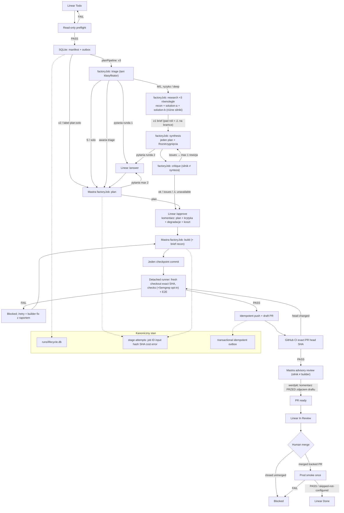

# Flow ticketu w ai-factory v2 (+ deep-plan v3)

```mermaid
flowchart TD
  A["Linear Todo"] --> B["Read-only preflight"]
  B -- "FAIL" --> A
  B -- "PASS" --> C["SQLite: manifest + outbox"]
  C -- "planPipeline: v3" --> TR["factoryJob: triage (tani klasyfikator)"]
  C -- "v2 / label plan:solo" --> D
  TR -- "pytania runda 1" --> E
  TR -- "S / solo" --> D["Mastra factoryJob: plan"]
  TR -- "M/L, ryzyko / deep" --> RS["factoryJob: research ×3 równolegle
recon + solution-a + solution-b (różne silniki)"]
  TR -- "awaria triage" --> D
  RS -- "≥1 brief (pad roli = ⚠️ na bramce)" --> SY["factoryJob: synthesis
jeden plan + Rozstrzygnięcia"]
  SY -- "pytania runda 2" --> E
  SY --> CR["factoryJob: critique (silnik ≠ synteza)"]
  CR -- "issues → max 1 rewizja" --> SY
  CR -- "ok / issues / ⚠️ unavailable" --> F
  D -- "pytania max 2" --> E["Linear /answer"]
  E --> D
  D -- "plan" --> F["Linear /approve
komentarz: plan + krytyka + degradacje + koszt"]
  F --> G["Mastra factoryJob: build (+ brief recon)"]
  G --> H["Jeden checkpoint commit"]
  H --> I["Detached runner: fresh checkout exact SHA, checks (+Semgrep opt-in) + E2E"]
  I -- "FAIL" --> J["Blocked; /retry = builder fix z raportem"]
  J --> G
  I -- "PASS" --> K["Idempotent push + draft PR"]
  K --> L["GitHub CI exact PR head SHA"]
  L -- "head changed" --> I
  L -- "PASS" --> M["Mastra advisory review (silnik ≠ builder)"]
  M -- "werdykt: komentarz PRZED zdjęciem draftu" --> M2["PR ready"]
  M2 --> N["Linear In Review"]
  N --> O{"Human merge"}
  O -- "closed unmerged" --> X["Blocked"]
  O -- "merged tracked PR" --> P["Prod smoke once"]
  P -- "PASS / skipped-not-configured" --> Q["Linear Done"]
  P -- "FAIL" --> X

  subgraph Durable["Kanoniczny stan"]
    R["runs/lifecycle.db"]
    S["stage attempts: job ID input hash SHA cost error"]
    T["transactional idempotent outbox"]
  end
  C -.-> R
  D -.-> S
  G -.-> S
  K -.-> T
```

## Stany

Etap: `plan | triage | research | synthesis | critique | approval | build | test
| publish | ci | review | merge | smoke` (etapy triage→critique istnieją tylko
dla projektów z `planPipeline: v3`; próby researchu są śledzone per rola:
`research-recon | research-solution-a | research-solution-b`).

Stan: `pending | running | waiting_human | waiting_external | blocked | done`.

Linear jest projekcją uproszczoną: `Todo`, `In Progress`, `In Review`, `Done`,
`👤 ⛔ Zablokowany`, `Canceled`. Zdarzenia GitHub i SQLite pozostają źródłem
prawdy nawet po ręcznym przestawieniu Lineara.

## Recovery

Każdy efekt ma stabilny idempotency key. Po restarcie poller:

1. odczytuje aktywne runy z SQLite;
2. sprawdza niedokończone komendy i joby Mastry;
3. weryfikuje dokładnie zapisany PR i head SHA;
4. kontynuuje wyłącznie zatrzymany etap.

Bezpieczniki runtime (2026-07-29): stall lease na joby Mastry (`JOB_STALLED`)
i runner testów (`TEST_STALLED`/`TEST_RUNNER_DIED`); outbox z wykładniczym
backoffem i alertem na każdy dead-letter; circuit breaker wstrzymuje claim
nowych ticketów; dzienny backup `runs/lifecycle.db` (`runs/backups/`);
single-writer lease blokuje drugi poller na tej samej bazie; kolizja
`planFiles` między ticketami odsuwa build (⏸️ komentarz w Linear); testy
exact-SHA biegną w detached procesie (`test-runner.ts`) — restart pollera ich
nie zabija, wynik wraca plikiem `runs/<ticket>/test-result-*.json`.

Registry v1 jest tylko do odczytu. Import wymaga zatwierdzonego planu,
jednoznacznego checkpointu lub jawnie wskazanego bieżącego PR-a oraz świeżego
odczytu Lineara/GitHuba/repo przed apply.

## Komentarze postępu

Każde objęte mapą przejście lifecycle atomowo enqueue'uje komentarz w tym samym
outboxie co pozostałe efekty. Klucz
`<ticket>:g<generacja>:progress:<hash-przejścia>` oraz tag
`[factory-outbox:<key>]` zapobiegają duplikatom po restarcie. Marker
`[linear:<ticket>:v2]` wyklucza komentarz ze snapshotu autora i
`effectiveInputHash`.

Poziom projektu `progress: off | milestones | verbose` (domyślnie
`milestones`, z obsługą `projects.local.yaml`) jest sprawdzany przy dispatchu.
`milestones` raportuje 7 głównych przejść od `/approve` do startu smoke;
`verbose` dodaje etapy deep-planu, retry/replan i degradacje. Bramki, blokady i
komentarze finałowe są osobnym kanałem i nie zależą od tego ustawienia.

## Deep-plan v3 (projekty z `planPipeline: v3`)

Cel: wyższa jakość planu przez synergiczną pracę równoległych agentów zamiast
jednego strzału jednego modelu (zastępuje zaprojektowany, niewdrożony
„dual-plan z fuzją" z backlogu CLAUDE.md #3).

- **Triage** (tani, read-only, 5 min): typ/rozmiar/domena/ryzyko, duplikaty i
  „już zaimplementowane" (pytanie z dowodem), braki w tickecie → pytania
  runda 1. Awaria triage = fallback do ścieżki solo, nigdy blokada (wyjątek:
  `BUDGET_EXHAUSTED`). Label `plan:solo`/`plan:deep` = ręczny override.
- **Research ×3 równolegle** (10 min/rola, różne silniki): recon (mapa kodu),
  solution-a (warianty + rekomendacja), solution-b (edge case'y + testy).
  Pad roli po 1 auto-retry → synteza jedzie dalej z ⚠️ widocznym na bramce;
  pad wszystkich → `RESEARCH_FAILED` (`/retry` ponawia brakujące role).
- **Synteza** (15 min): jeden plan w kontrakcie `factory` + sekcja
  `## Rozstrzygnięcia`; pytania runda 2 (wspólny limit 2 rund na ticket).
- **Krytyka** (8 min, silnik ≠ synteza przez `excludeEngine`+`critique.diverse`):
  checklista adwersaryjna; `issues` → dokładnie JEDNA rewizja syntezy; drugi
  werdykt idzie na bramkę bez pętli. Krytyka advisory — `unavailable` = ⚠️
  na bramce, nie blokada.
- **Bramka `/approve` bez zmian mechanicznie**; komentarz zawiera plan,
  werdykt krytyki, degradacje i koszt planowania.
- Brief recon zasila buildera, brief ryzyk + uwagi krytyka zasilają reviewera
  (wszystko clipowane — lekcja E2BIG).

## Eksperyment kosztowo-jakościowy

`runs/experiments.jsonl`: wiersz `summary` przy każdym Done (wariant
solo/deep/v2, koszty i first-pass per etap, sygnatury modeli z faktycznych
prób, degradacje, retry/replan, lead time) + wiersz `score` z komendy
`/score 1-5 [komentarz]` (działa też po Done — sweep 14 dni). Raport:
`npx tsx src/metrics/experiment-report.ts`.
